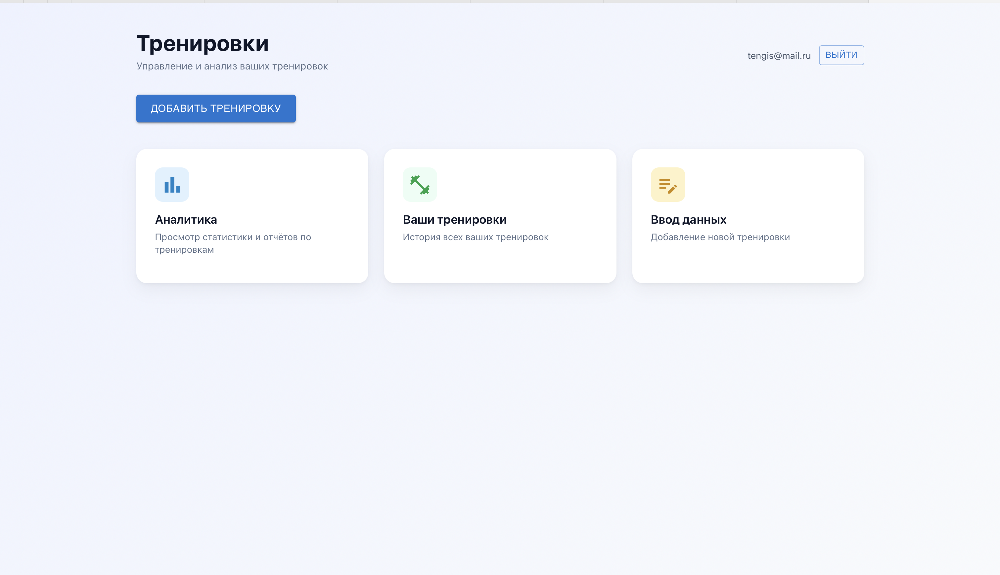

# Training Analytics

Веб-приложение для учёта и анализа тренировок.

---

## Список технологий

- **React 19** — UI-библиотека
- **TypeScript** — типизация
- **Redux Toolkit** — состояние приложения (авторизация и данные)
- **React Router** — маршрутизация
- **Material UI (MUI)** — компоненты и стили
- **ECharts / echarts-for-react** — графики и аналитика
- **Axios** — HTTP-запросы к API
- **date-fns** — работа с датами
- **Create React App** — сборка и dev-сервер

---

## Памятка по запуску

1. **Клонировать репозиторий и установить зависимости:**
   ```bash
   npm install
   ```

2. **Настроить переменные окружения (опционально):**  
   Создайте файл `.env` в корне проекта и укажите URL бэкенда:
   ```env
   REACT_APP_API_URL=http://localhost:8080
   ```
   Если переменная не задана, запросы уходят на тот же origin, что и фронтенд.

3. **Запустить приложение:**
   ```bash
   npm start
   ```
   Приложение откроется в браузере по адресу [http://localhost:3000](http://localhost:3000).

4. **Сборка для продакшена:**
   ```bash
   npm run build
   ```

---

## Скриншот стартовой страницы

Стартовая страница — **страница входа** (логин). После авторизации открывается **дашборд** с навигацией по разделам: добавление тренировки, список тренировок, аналитика.



